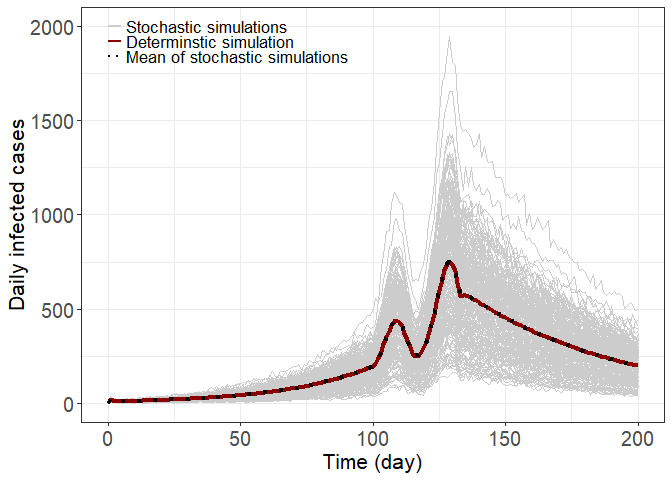

Estimating the instantaneous reproduction number (R_t) by using particle
filter
================
June 20, 2023

### Install the pfilterCOVID package

``` r
# devtools::load_all()
# devtools::install()
# devtools::install_github("kimfinale/pfilterCOVID", force = TRUE)
```

### Load packages

``` r
library(pfilterCOVID)
library(magrittr)
library(deSolve)
library(tidyverse)
```

``` r
library(ggplot2)
library(cowplot)
library(EpiEstim)
library(dplyr)
library(rstan)
```


``` r
source('R/deconvolve.R')
```

### Set parameter values

``` r
# beta is updated by R0
THETA <- list(beta = 0.3, R0 = 1.2, epsilon = 1/2.5, delta = 1/5, 
            gamma = 1/2.5, bp = 1, ba = 1, fa = 0.3, fd = 1, I0 = 1e2, # I0 = initial infection size
            time_dep_Rt = FALSE)

# this changes the default y0 in the pfilterCOVID package
THETA$Y0 <- c(S = 1e7 - THETA$I0, E = 0, P = 0, A = 0, 
              I = THETA$I0, R = 0, CE = 0, CI = 10, CR = 0)
THETA$tend <- 200
usethis::use_data(THETA, overwrite = TRUE)
```


### Run the ODE version (generate the dataset, D1, and Figure 2A)

``` r
theme_set(theme_bw())

params <- THETA
tend <- params$tend

params$I0 <- 100
params$Y0 <- c(S = 1e7 - params$I0, E = 0, P = 0, A = 0, 
              I = params$I0, R = 0, CE = 0, CI = 0, CR = 0)

tstamp <- format(Sys.time(), "%Y%m%d")
times <- seq(0, tend, by = 1)

params$time_dep_Rt <- TRUE
ode(y = params$Y0, times = times, func = ode_sepair, parms = params) %>% 
  as.data.frame() -> out 

out$daily_infected <- c(0, diff(out$CE)) 
out$daily_symptom <- c(0, diff(out$CI)) 
out$daily_confirmed <- c(0, diff(out$CR))
out$daily_Rt <- sapply(0:tend, function(x) get_Rt(x))
# "out" contains daily time series for infection, symptom, and confirmation
# (corresponds to the dataset, D1, in the manuscript)

# saveRDS(out, paste0("outputs/ode_I0_100_", tstamp, ".rds"))
out_long <- out %>% pivot_longer(-time) 
out_long$name <- factor(out_long$name,
                        levels = c("S", "E", "P", "A", "I", "R", 
                                  "CE", "CI", "CR", "daily_infected", 
                                  "daily_symptom", "daily_confirmed", "daily_Rt"))
```

#### Figure 2A

``` r
tstamp <- "20230619"
out <- readRDS(paste0("outputs/ode_I0_100_", tstamp, ".rds"))
out_long <- out %>% pivot_longer(-time) 
out_long$name <- factor(out_long$name,
                        levels = c("S", "E", "P", "A", "I", "R", 
                                  "CE", "CI", "CR", "daily_infected", 
                                  "daily_symptom", "daily_confirmed", "daily_Rt"))

# Generate Figure 2A.
fig2a <- out_long %>%
  filter(name == "daily_infected" | 
           name == "daily_symptom" | name == "daily_confirmed") %>%
  ggplot(aes(x = time, y = value, color = name)) +
  geom_line(linewidth=1.2) +
  labs(x='Time (day)', y = 'Number of individuals', color = "") +
       theme(legend.position = c(.2, .9), 
             legend.background = element_rect(fill='transparent')) +
  scale_color_hue(labels=c("daily_infected" = "Infection",
                           "daily_symptom"="Symptom",
                           "daily_confirmed"="Confirmation"))+
  theme(text = element_text(size=16),
        axis.text = element_text(size=13),
        legend.text=element_text(size=13))
```

### Plots of Rt and infection/confirmation time series of stoch outputs

``` r
# Rt data set; Rt_dataset_I0=100_20220105.rds, Rt_dataset_I0=10_20220105.rds
tstamp <- "20220105"
dat <- readRDS(paste0("outputs/Rt_dataset_I0=100_", tstamp, ".rds"))
# Generate Figure 2B.
# plot for the pre-defined Rt
fig2b <- ggplot() +
  geom_line(aes(x=dat$time, y = dat$Rt)) +
  labs(x="Time (day)", y = expression(paste(italic(R)[italic(t)])))+
  theme(text = element_text(size=16),
        axis.text = element_text(size=13),
        legend.text = element_text(size=13))
    

# Generate plots for a comparison of simulated data (deterministic vs. stochastic, both with perfect observation) for daily_infected or confirmed.
oderes <- dat$ode[, c("time", "daily_infected", "daily_confirmed")]
oderes %>% pivot_longer(cols = -time) -> oderes

stochres <- dat$stoch_perfect_obs$daily_confirmed[,1:length(dat$stoch_perfect_obs$daily_confirmed)]
stochres$time <- dat$time

stochres %>% pivot_longer(cols = -time) -> stochres

# plt_case <- ggplot() +
#   geom_line(data = stochres, aes(time, value, group=name), color="grey50") +
#   geom_line(data = oderes, aes(time, value, color=name), size=1.2) + 
#   labs(x="time", y="", color="")
```

### Run the Gillespie’s direct method (generate the datset, D2, and Figure 2)

This is to create a stochastic data set based on the Gillespie’s direct
method

``` r
set.seed(42)
# tstamp <- format(Sys.time(), "%Y%m%d")
nrun <- 20 # increase the number to obtain large samples

res <- gillespie_run(func = gillespie_sepair, 
                     tend = tend, 
                     nrun = nrun, 
                     y0 = params$Y0, 
                     params = params, 
                     report_dt = 1)

# saveRDS(res, "outputs/res_20230619.rds")
```

#### Figure 2c

``` r
res <- readRDS("outputs/res_20230619.rds")
nrun <- 20 
daily_infected <- data.frame(matrix(0, nrow = tend + 1, ncol = nrun))
daily_symptom <- data.frame(matrix(0, nrow = tend + 1, ncol = nrun))
daily_confirmed <- data.frame(matrix(0, nrow = tend + 1, ncol = nrun))

for (i in seq_len(length(res))) {
  inf <- diff(res[[i]]$CE)
  onset <- diff(res[[i]]$CI)
  conf <- diff(res[[i]]$CR)
  daily_infected[1:(length(inf)+1), i] <- c(0, inf)
  daily_symptom[1:(length(onset)+1), i] <- c(0, onset)
  daily_confirmed[1:(length(conf)+1), i] <- c(0, conf)
}

daily_infected <- data.frame(matrix(0, nrow = tend + 1, ncol = nrow(dat$stoch_perfect_obs$daily_infected)))
for (i in 1:nrow(dat$stoch_perfect_obs$daily_infected)) {
  daily_infected[,i] <- dat$stoch_perfect_obs$daily_infected[[i]]
}

stoch <- list()
stoch$daily_confirmed <- daily_confirmed
stoch$daily_symptom <- daily_symptom
stoch$daily_infected <- daily_infected
stoch$daily_Rt <- sapply(0:tend, function(x) get_Rt(x))
# "stoch" contains daily time series for infection, symptom, and confirmation (corresponds to the dataset, D2, in the manuscript)

# saveRDS(stoch, paste0("outputs/stoch_I0_100_", tstamp, ".rds"))

df <- daily_infected
df$time <- 0:tend
df %>% pivot_longer(cols = -time) -> df

# Generate Figure 2C.
locy = c(2000,1920,1840)
fig2c <- ggplot() +
  geom_line(data = df, aes(time, value, group = name), 
            color = "grey80") +
  geom_line(data = out, aes(time, daily_infected), # ODE model output
            color = "darkred",
            size = 1.5, inherit.aes = FALSE) + 
  labs(x="Time (day)", y="Daily infected cases", color="") + 
  geom_segment(aes(x=c(0,0,0), xend=c(5,5,5), y=locy,
                yend=locy), size=c(1,1,1), 
               color = c("grey80", "darkred","black"),
               linetype = c("solid","solid","dotted")) +
  geom_line(aes(dat$time, rowMeans(dat$stoch_perfect_obs$daily_infected)), # mean of stochastic simulations ## simply to load the data we are using (2,000 simulations) - save time
            linetype = "dotted",
            size = 1.5, inherit.aes = FALSE) +
  geom_text(aes(x=c(7,7,7), y=locy), size=c(4.6,4.6,4.6), 
               hjust = c(0,0,0), vjust = c(0.5,0.5,0.5), 
               label = c("Stochastic simulations",
                         "Determinstic simulation",
                         "Mean of stochastic simulations"))+
  theme(text = element_text(size=16),
        axis.text = element_text(size=13),
        legend.text=element_text(size=13))
```


``` r
# Generate Figure 2.
# NB. Figure 1 is a compartment flow diagram which was not generated by code
left_col_fig2 <- plot_grid(fig2a, fig2b, nrow = 2, labels = "AUTO")
figure2 <- plot_grid(left_col_fig2, fig2c, labels = c("", "C"))
figure2
```

<!-- -->

``` r
# ggsave("plots/daily_case_20230619.png", plot=figure2,
#        width=3.4*3, height=2.7*3, units="in")
```

#### Total dataset

The data set that contains all the necessary information: Rt trajectory,
ODE and stochastic model result

``` r
Rt_dataset <- list()
Rt_dataset$README <- "To see if potential bias of Rt estimation based on the confirmation data set, especially in the most recent time, is reduced or eliminated when the number of cases are large"
Rt_dataset$ode <- out
Rt_dataset$stoch_perfect_obs <- stoch
Rt_dataset$Rt <- sapply(0:tend, function(x) get_Rt(x))
Rt_dataset$time <- out$time
Rt_dataset$params <- params
Rt_dataset$y0 <- params$Y0
# saveRDS(Rt_dataset, paste0("outputs/Rt_dataset_I0=100_", tstamp, ".rds"))
```

### Rt estimation using the particle filter

Particle filtering - particle_filter Expect errors since backward
sampling is not in place

``` r
set.seed(1)
tstamp <- "20220105"
I0 <- 100
dat <- readRDS(paste0("outputs/Rt_dataset_I0=", I0, "_", tstamp, ".rds"))

# determine the data type to model (infection vs. confirmation)
dtype <- "confirmation"
# dtype <- "infection"
if (dtype == "confirmation") {
  d <- dat$ode[, c("time", "daily_confirmed")]
} else {
  d <- dat$ode[, c("time", "daily_infected")]
}

dat$params$time_dep_Rt <- FALSE # this must be set FALSE to produce daily estimates

params <- dat$params
params[["betavol"]] <- 0.2 #standard deviation of the prior distribution

npart = 1e4 # increase the number of particles to obtain more accurate estimates

pf <- pfilter(
  params = params,
  y = params$Y0,
  data = d,
  data_type = dtype,
  npart = npart,
  tend = nrow(d),
  dt = 0.1,
  error_pdf = "pois",
  systematic_resampling = FALSE,
  backward_sampling = TRUE,
  stoch = FALSE)

# Rt <- readRDS("outputs/Rt_default.rds")
epsilon <- params[["epsilon"]]
delta <- params[["delta"]]
gamma <- params[["gamma"]]
bp <- params[["bp"]] # relative infectiousness of pre-symptomatic state
ba <- params[["ba"]] # relative infectiousness of asymptomatic state
fa <- params[["fa"]] # fraction of asymptomatic state

durP <- (1 / delta - 1 / epsilon)
durI <- (1 / gamma)
R0_dur <- ((1 - fa) + fa * ba) * durI + bp * durP

med <- apply(pf$beta_filtered, 1, quantile, probs = c(0.5))
# plot(dat$time + 2, dat$daily_Rt, type="l", ylim=c(0, max(upper * R0_dur)))
# Comarison between the pre-determined Rt and PF (without backward sampling) inferred Rt based on ODE daily_confirmed
plot(dat$ode$time + 2, dat$ode$daily_Rt, type="l")
lines(med * R0_dur, lwd=2, col=3)
```

<!-- -->

### Fitting the infection or confirmation time series from the ODE model

This uses the extract_trace function that calls pfilter function and
also executes backward sampling

``` r
# apply on infection time series
theme_set(theme_bw())

tstamp <- "20220105"
dat <- readRDS(paste0("outputs/Rt_dataset_I0=100_", tstamp, ".rds"))
params <- dat$params
params$time_dep_Rt <- FALSE
params[["betavol"]] <- 0.2 

# increase the number to improve accuracy
nrep <- 1e3
npart <- 1e4
dt <- 0.2
library(parallel)
library(doParallel)
```


``` r
ncores <- detectCores() - 1
d_inf <- data.frame(date = dat$time, daily_infected = round(dat$ode$daily_infected))
set.seed(42)
cl <- makeCluster(getOption("cl.cores", ncores))
doParallel::registerDoParallel(cl)
```

#### PF based on the infection time series

``` r
pf_inf <- foreach(i = 1:nrep, .packages = c("pfilterCOVID"), .inorder = F) %dopar% {
 extract_trace(params = params,
                    y = params$Y0,
                    data = d_inf,
                    data_type = "infection",
                    npart = npart,
                    tend = nrow(d_inf),
                    dt = dt,
                    error_pdf = "pois",
                    negbin_size = 15,
                    backward_sampling = TRUE,
                    stoch = FALSE)
}
parallel::stopCluster(cl)
# saveRDS(pf_inf, "outputs/pf_inf_20230619.rds")
```

#### Figure 3

``` r
pf_inf <- readRDS("outputs/pf_inf_20230619.rds")
nrep <- 1e3
npart <- 1e4
dt <- 0.2
tstamp <- "20220105"
parset_chr <- paste0(dtype, "_I0=", params$I0, "_npart=", npart,
           "_nrep=", nrep, "_dt=", dt, "_", tstamp)
  
pr <- c(0.025, 0.25, 0.5, 0.75, 0.975)
Rt_est <- as.data.frame(sapply(pf_inf, function(x) x[, "Rt"]))
Rt_quantile <- as.data.frame(t(apply(Rt_est, 1, function(x) quantile(x, pr))))
  
df_inf <- cbind(Rt_quantile, d_inf)
col_fill <- "deepskyblue4"
col_dat <- "grey70"
df_inf$Rt <- dat$ode$daily_Rt

fig3a <- ggplot(df_inf[81:201,], aes(x = date)) +
    geom_ribbon(aes(ymin = `2.5%`, ymax = `97.5%`), fill = col_fill, alpha = 0.5) +
    geom_ribbon(aes(ymin = `25%`, ymax = `75%`), fill = col_fill, alpha = 0.8) +
    geom_line(aes(y = `50%`), color = "darkblue", size = 1.2) +
    geom_line(aes(x = date, y = dat$ode$daily_Rt[80:200]), size = 1, linetype = "dashed") +
    geom_hline(yintercept = 1, color = "black", size = 1, linetype = "dotted")+
    labs(y = expression(italic(R)[italic(t)]), x = "Time (day)") + 
    coord_cartesian(ylim = c(0.25, 2.25))+scale_y_continuous(breaks=seq(0,2.25,by=0.5))+
  theme(text = element_text(size=16),
        axis.text = element_text(size=13),
        legend.text=element_text(size=13))
fig3a
```

<!-- -->

``` r
# ggsave(paste0("plots/", parset_chr, ".png"), plt)
```

``` r
# apply on confirmation time series
d_conf <- data.frame(date = dat$time,
               daily_confirmed = round(dat$ode$daily_confirmed))
```

#### PF based on the confirmation time series

``` r
set.seed(42)
cl <- makeCluster(getOption("cl.cores", ncores))
doParallel::registerDoParallel(cl)

pf_conf <- foreach(i = 1:nrep, .packages = c("pfilterCOVID"), .inorder = F) %dopar% {
 extract_trace(params = params,
                    y = params$Y0,
                    data = d_conf,
                    data_type = "confirmation",
                    npart = npart,
                    tend = nrow(d_conf),
                    dt = dt,
                    error_pdf = "pois",
                    negbin_size = 15,
                    backward_sampling = TRUE,
                    stoch = FALSE)
}
parallel::stopCluster(cl)
# saveRDS(pf_conf, "outputs/pf_conf_20230619.rds")  
```

#### Figure 3b

``` r
pf_conf <- readRDS("outputs/pf_conf_20230619.rds")
parset_chr <- paste0(dtype, "_I0=", params$I0, "_npart=", npart,
           "_nrep=", nrep, "_dt=", dt, "_", tstamp)
  
Rt_est <- as.data.frame(sapply(pf_conf, function(x) x[, "Rt"]))
Rt_quantile <- as.data.frame(t(apply(Rt_est, 1, function(x) quantile(x, pr))))
  
df_conf <- cbind(Rt_quantile, d_conf)
df_conf$Rt <- dat$ode$daily_Rt

fig3b <- ggplot(df_conf[81:201,], aes(x = date)) +
    geom_ribbon(aes(ymin = `2.5%`, ymax = `97.5%`), fill = col_fill, alpha = 0.5) +
    geom_ribbon(aes(ymin = `25%`, ymax = `75%`), fill = col_fill, alpha = 0.8) +
    geom_line(aes(y = `50%`), color = "darkblue", size = 1.2) +
    geom_line(aes(x = date, y = dat$ode$daily_Rt[80:200]), size = 1, linetype = "dashed") +
    geom_hline(yintercept = 1, color = "black", size = 1, linetype = "dotted")+
    labs(y = expression(italic(R)[italic(t)]), x = "Time (day)") + 
    coord_cartesian(ylim = c(0.25, 2.25))+scale_y_continuous(breaks=seq(0,2.25,by=0.5))+
  theme(text = element_text(size=16),
        axis.text = element_text(size=13),
        legend.text=element_text(size=13))
# fig3b

# put all together for figure 3
figure3 <- plot_grid(fig3a, fig3b, nrow = 2, labels = "AUTO")
figure3
```

<!-- -->

``` r
# ggsave("plots/Rt_recovered_20230619.png", plot=figure3,
#        width=3.4*2, height=2.7*2, units="in")
```

### Fitting confirmation time series from the stochastic model

``` r
library(pfilterCOVID)
library(ggplot2)
theme_set(theme_bw())

tstamp <- "20220105"
dat <- readRDS(paste0("outputs/Rt_dataset_I0=100_", tstamp, ".rds"))
params <- dat$params
params$time_dep_Rt <- FALSE
params[["betavol"]] <- 0.2 

nrep <- 1e3
npart <- 1e4
dt <- 0.2
```

``` r
d_stoc_19 <- data.frame(date = dat$time, daily_confirmed = round(dat$stoch_perfect_obs$daily_confirmed[,19]))
```

``` r
library(parallel)
library(doParallel)
set.seed(42)
ncores <- detectCores()
cl <- makeCluster(getOption("cl.cores", 2))
doParallel::registerDoParallel(cl)

# apply on the stochastic seed #19 (fig 4b)
pf_stoc_19 <- foreach(i = 1:nrep, .packages = c("pfilterCOVID"), .inorder = F) %dopar% {
 extract_trace(params = params,
                    y = params$Y0,
                    data = d_stoc_19,
                    data_type = "confirmation",
                    npart = npart,
                    tend = nrow(d_stoc_19),
                    dt = dt,
                    error_pdf = "pois",
                    negbin_size = 15,
                    backward_sampling = TRUE,
                    stoch = FALSE)
}
parallel::stopCluster(cl)
# saveRDS(pf_stoc_19, "outputs/pf_stoc_19_20230619.rds")  
```

#### Figure 4b

``` r
pf_stoc_19 <- readRDS("outputs/pf_stoc_19_20230619.rds")
parset_chr <- paste0(dtype, "_I0=", params$I0, "_npart=", npart,
           "_nrep=", nrep, "_dt=", dt, "_", tstamp)
  
pr <- c(0.025, 0.25, 0.5, 0.75, 0.975)
Rt_est <- as.data.frame(sapply(pf_stoc_19, function(x) x[, "Rt"]))
Rt_quantile <- as.data.frame(t(apply(Rt_est, 1, function(x) quantile(x, pr))))
  
df_stoc_19 <- cbind(Rt_quantile, d_stoc_19)
col_fill <- "red"
col_dat <- "grey70"
df_stoc_19$Rt <- dat$ode$daily_Rt

fig4b <- ggplot(df_stoc_19[81:201,], aes(x = date)) +
    geom_ribbon(aes(ymin = `2.5%`, ymax = `97.5%`), fill = col_fill, alpha = 0.5) +
    geom_ribbon(aes(ymin = `25%`, ymax = `75%`), fill = col_fill, alpha = 0.8) +
    geom_line(aes(y = `50%`), color = "darkred", size = 1.2) +
    geom_line(aes(x = date + 1, y = Rt), size = 1, linetype = "dashed") +
    geom_hline(yintercept = 1, color = "black", size = 1, linetype = "dotted")+
    labs(y = expression(italic(R)[italic(t)]), x = "Time (day)") + 
    coord_cartesian(ylim = c(0.25, 2.75))+
  scale_y_continuous(breaks=seq(0,2.75,by=0.5))+
  theme(text = element_text(size=16),
        axis.text = element_text(size=13),
        legend.text=element_text(size=13))
```

#### PF based on the confirmation time series derived from the stochastic model

``` r
# apply on the stochastic seed #04 (fig 4c)
d_stoc_04 <- data.frame(date = dat$time,
               daily_confirmed = round(dat$stoch_perfect_obs$daily_confirmed[,4]))
```

``` r
set.seed(42)
cl <- makeCluster(getOption("cl.cores", 2))
doParallel::registerDoParallel(cl)

pf_stoc_04 <- foreach(i = 1:nrep, .packages = c("pfilterCOVID"), .inorder = F) %dopar% {
 extract_trace(params = params,
                    y = params$Y0,
                    data = d_stoc_04,
                    data_type = "confirmation",
                    npart = npart,
                    tend = nrow(d_stoc_04),
                    dt = dt,
                    error_pdf = "pois",
                    negbin_size = 15,
                    backward_sampling = TRUE,
                    stoch = FALSE)
}
parallel::stopCluster(cl)
# saveRDS(pf_stoc_04, "outputs/pf_stoc_04_20230619.rds")
```

``` r
pf_stoc_04 <- readRDS("outputs/pf_stoc_04_20230619.rds")
parset_chr <- paste0(dtype, "_I0=", params$I0, "_npart=", npart,
           "_nrep=", nrep, "_dt=", dt, "_", tstamp)
  
pr <- c(0.025, 0.25, 0.5, 0.75, 0.975)
Rt_est <- as.data.frame(sapply(pf_stoc_04, function(x) x[, "Rt"]))
Rt_quantile <- as.data.frame(t(apply(Rt_est, 1, function(x) quantile(x, pr))))
  
df_stoc_04 <- cbind(Rt_quantile, d_stoc_04)
col_fill <- "green"
col_dat <- "grey70"
df_stoc_04$Rt <- dat$ode$daily_Rt

fig4c <- ggplot(df_stoc_04[81:201,], aes(x = date)) +
    geom_ribbon(aes(ymin = `2.5%`, ymax = `97.5%`), fill = "#76ff7a", alpha = 0.5) +
    geom_ribbon(aes(ymin = `25%`, ymax = `75%`), fill = "green", alpha = 0.8) +
    geom_line(aes(y = `50%`), color = "darkgreen", size = 1.2) +
    geom_line(aes(x = date + 1, y = Rt), size = 1, linetype = "dashed") +
    geom_hline(yintercept = 1, color = "black", size = 1, linetype = "dotted")+
    labs(y = expression(italic(R)[italic(t)]), x = "Time (day)") + 
    coord_cartesian(ylim = c(0.25, 2.75))+
  scale_y_continuous(breaks=seq(0,2.75,by=0.5))+
  theme(text = element_text(size=16),
        axis.text = element_text(size=13),
        legend.text=element_text(size=13))
```

#### PF based on the confirmation time series dervied from the stochastic model

Incidence level is lower than the deterministic model

``` r
# apply on the stochastic seed #02 (fig 4d)
d_stoc_02 <- data.frame(date = dat$time,
               daily_confirmed = round(dat$stoch_perfect_obs$daily_confirmed[,2]))
```

``` r
set.seed(42)
cl <- makeCluster(getOption("cl.cores", 2))
doParallel::registerDoParallel(cl)

pf_stoc_02 <- foreach(i = 1:nrep, .packages = c("pfilterCOVID"), .inorder = F) %dopar% {
 extract_trace(params = params,
                    y = params$Y0,
                    data = d_stoc_02,
                    data_type = "confirmation",
                    npart = npart,
                    tend = nrow(d_stoc_02),
                    dt = dt,
                    error_pdf = "pois",
                    negbin_size = 15,
                    backward_sampling = TRUE,
                    stoch = FALSE)
}
parallel::stopCluster(cl)
# saveRDS(pf_stoc_02, "outputs/pf_stoc_02_20230619.rds")  
```

#### Figure 4d

``` r
pf_stoc_02 <- readRDS("outputs/pf_stoc_02_20230619.rds")  
parset_chr <- paste0(dtype, "_I0=", params$I0, "_npart=", npart,
           "_nrep=", nrep, "_dt=", dt, "_", tstamp)
  
pr <- c(0.025, 0.25, 0.5, 0.75, 0.975)
Rt_est <- as.data.frame(sapply(pf_stoc_02, function(x) x[, "Rt"]))
Rt_quantile <- as.data.frame(t(apply(Rt_est, 1, function(x) quantile(x, pr))))
  
df_stoc_02 <- cbind(Rt_quantile, d_stoc_02)
col_fill <- "blue"
col_dat <- "grey70"
df_stoc_02$Rt <- dat$ode$daily_Rt

fig4d <- ggplot(df_stoc_02[81:201,], aes(x = date)) +
    geom_ribbon(aes(ymin = `2.5%`, ymax = `97.5%`), fill = col_fill, alpha = 0.5) +
    geom_ribbon(aes(ymin = `25%`, ymax = `75%`), fill = col_fill, alpha = 0.8) +
    geom_line(aes(y = `50%`), color = "darkblue", size = 1.2) +
    geom_line(aes(x = date + 1, y = Rt), size = 1, linetype = "dashed") +
    geom_hline(yintercept = 1, color = "black", size = 1, linetype = "dotted")+
    labs(y = expression(italic(R)[italic(t)]), x = "Time (day)") + 
    coord_cartesian(ylim = c(0.25, 2.75))+
  scale_y_continuous(breaks=seq(0,2.75,by=0.5))+
  theme(text = element_text(size=16),
        axis.text = element_text(size=13),
        legend.text=element_text(size=13))

# Generate figure 4
df_stoc <- data.frame(date=dat$ode$time, ode=dat$ode$daily_confirmed, c2=dat$stoch_perfect_obs$daily_confirmed[,2], c4=dat$stoch_perfect_obs$daily_confirmed[,4], c19=dat$stoch_perfect_obs$daily_confirmed[,19])

fig4a <- ggplot(df_stoc) + geom_line(aes(x=date, y=ode), color="black")+geom_line(aes(x=date,y=c2),color="blue")+geom_line(aes(x=date,y=c4),color="green")+geom_line(aes(x=date,y=c19),color="red") +
    labs(y = "Number of confirmation", x = "Time (day)") +
  scale_color_hue(labels=c("ode" = "ODE", "c2"="Low", "c4"="Medium", "c19"="High")) +
    geom_segment(aes(x=0, xend=5, y=1000, yend=1000), size=1, color = "red", linetype = "solid") +
      geom_segment(aes(x=0, xend=5, y=950, yend=950), size=1, color = "green", linetype = "solid") +
      geom_segment(aes(x=0, xend=5, y=900, yend=900), size=1, color = "blue", linetype = "solid") +
  geom_text(aes(x=7, y=1000), size=4.6, hjust=0, vjust=0.5, label="High intensity") +
  geom_text(aes(x=7, y=950), size=4.6, hjust=0, vjust=0.5, label="Medium intensity") +
  geom_text(aes(x=7, y=900), size=4.6, hjust=0, vjust=0.5, label="Low intensity")+
  theme(text = element_text(size=16),
        axis.text = element_text(size=13),
        legend.text=element_text(size=13))

left_col <- plot_grid(fig4a, labels = c("A"))
right_col <- plot_grid(fig4b, fig4c, fig4d, nrow = 3, labels = c("B", "C", "D"))
figure4 <- plot_grid(left_col, right_col, ncol = 2)
figure4
```

<!-- -->

``` r
# ggsave("plots/Rt_stoch_recovered_20230619.png", plot=figure4,
#        width=3.4*2, height=2.7*2, units="in")
```

### Rt estimation using EpiEstim

Computing mean and std of generation time

``` r
# infection (disease) age for generation time
norm_factor <- integrate(function(x) {
  1 - pgamma(x, shape = 2, rate = 1/2.5)}, 0, Inf)
f <- function(x) {
  (1 - pgamma(x, shape = 2, rate = 1/2.5))/norm_factor$value}

# latent time
g <- function(x) { dexp(x, rate = 1/2.5) }

z <- function(z) {
  integrate(function(x, z) g(z-x)*f(x), 0, Inf, z)$value}
fz <- Vectorize(z)

## upper is set to arbitrarily large number 
mean_int <- integrate(function(y) y*fz(y), lower = 0, upper = 100, subdivisions = 1e4)
var_int <- integrate(function(y) y^2*fz(y), lower = 0, upper = 100, subdivisions = 1e4)
var <- var_int$value - mean_int$value^2  # variance = E[x^2] - E[X]^2
mean_int$value
```

    ## [1] 6.249147

``` r
sqrt(var)
```

    ## [1] 4.145278

``` r
# from Mathematica
mean <- 6.25 # mean_si
std <- 4.14578 # std_si
```

### Apply EpiEstim on daily confirmation series

Expect discrepancy (i.e., delay) between the pre-defined Rt and the
estimated Rt) \#### Figure 5

``` r
# Moving average
MA <- function(input_ts, lookback) {
  sum <- 0
  look_back1 <- lookback + 1
  ma_input <- rep(0, length(input_ts))
  for (i in 1:length(input_ts)) {
    sum = sum + input_ts[i]
    if (i < look_back1) {
      ma_input[i] <- sum / i
    } else {
      sum = sum - input_ts[i-7]
      ma_input[i] <- sum / 7
    }
  }
  return(ma_input)
}

# apply EpiEstim on confirmation time series (ODE version)
ma_input <- MA(dat$ode$daily_confirmed, 7)

T <- length(ma_input)
time_window <- 1
t_start <- seq(3, T-(time_window-1))
t_end <- t_start + time_window-1

res_daily <- estimate_R(ma_input, method = "parametric_si",
                        config = make_config((list(t_start = t_start, t_end = t_end, mean_si = 6.25, std_si = 4.14578))))

df_epi_ode_conf <- data.frame(sapply(res_daily$R,c))
df_epi_ode_conf$Rt <- dat$ode$daily_Rt[3:201]
df_epi_ode_conf$time <- t_start-1

col_fill <- "deepskyblue4"
col_dat <- "grey70"

figure5 <- 
  ggplot(df_epi_ode_conf[80:199,], aes(x = time)) +
  geom_ribbon(aes(ymin = Quantile.0.025.R., ymax = Quantile.0.975.R.), fill = col_fill, alpha = 0.5) +
  geom_ribbon(aes(ymin = Quantile.0.25.R., ymax = Quantile.0.75.R.), fill = col_fill, alpha = 0.8) +
  geom_line(aes(y = Median.R.), color = "darkblue", size = 1.2) +
  geom_line(aes(x = time, y = Rt), colour = "black", size = 1, linetype = "dashed") +
  geom_hline(yintercept = 1, color = "black", size = 1, linetype = "dotted")+
  labs(y = expression(italic(R)[italic(t)]), x = "Time (day)")+
  theme(text = element_text(size=16),
        axis.text = element_text(size=13),
        legend.text=element_text(size=13))

figure5
```

<!-- -->

``` r
# ggsave("plots/EpiEstim_Rt_delay_20230619.png", plot=figure5,
#        width=3.4*2, height=2.7, units="in")
```

# Introduce a delay distribution to address the delay observed above (for deconvolutions)

``` r
delay_dist <- {
  t <- seq(0, 19)
  p_unnorm <- pgamma(t + 1, shape = 3, rate = 1/2.5) - 
    pgamma(t, shape = 3, rate = 1/2.5)
  data.frame(delay = t, pmf = p_unnorm / sum(p_unnorm))
}
```

### Rt based on renewal equation (without misspecification effect of SI)

#### Figure 6

Estimate Rt by applying deconvolution on confimration series, followed
by EpiEstim

``` r
# apply on the stochastic seed #19 (fig 6a)
input_ts <- dat$stoch_perfect_obs$daily_confirmed[,19]
# obtain moving average before deconvolution
ma <- seq(0, length(input_ts)-1)
lookback <- 7
sum <- 0
for (i in 1:length(input_ts)){
  sum = sum + input_ts[i]
  if (i < lookback+1) {
    ma[i] = sum / i
  } else {
    sum = sum - input_ts[i-7]
    ma[i] = sum / 7
  }
}
result <- deconvolve_rltype_goldsteinetal(
  t_obs_min = dat$time[1],
  y_obs = round(ma),
  delay_min = delay_dist$delay[1],
  pmf_delay = delay_dist$pmf,
  t_unobs_min = dat$time[1],
  n_unobs = length(dat$time),
  n_iterations_max = 100,
  n_iterations = NULL
)
# output to the above opearation is defined as "result$x_unobs"
unobs <- result$x_unobs

# simple plots for the output of deconvolution (i.e., inferred infection), and the infection from the ODE model
# determine an appropriate lag value by comparing the peaks
plot(unobs)
lines(dat$ode$daily_infected)
```

<!-- -->

``` r
lag <- which.max(dat$ode$daily_infected) - which.max(unobs)
#lag
# adjust the inferred infection (i.e., unobs)
# exclude first 4 elements of unobs (when, e.g., lag=4) as out of estimation period of our interest
# this causes 4 less estimates (i.e., upto t=196 instead of t=200 for lag=4)
unobs <- unobs[5:length(unobs)]

# now apply EpiEstim
T <- length(unobs)
time_window <- 1
t_start <- seq(3, T-(time_window-1))
t_end <- t_start + time_window-1

res_daily <- estimate_R(unobs, method = "parametric_si",
                            config = make_config((list(t_start = t_start, t_end = t_end, mean_si = 6.25, std_si = 4.14578))))
```

    ## Warning in estimate_R_func(incid = incid, method = method, si_sample = si_sample, : You're estimating R too early in the epidemic to get the desired
    ##             posterior CV.

``` r
# used the mean and std of generation time above for mean_si and std_si

df_epi_19 <- data.frame(sapply(res_daily$R,c))
df_epi_19 <- rbind(df_epi_19, c(NA,NA,NA,NA,NA), c(NA,NA,NA,NA,NA), c(NA,NA,NA,NA,NA), c(NA,NA,NA,NA,NA))
```


``` r
df_epi_19$time <- dat$time[3:201]
df_epi_19$Rt <- dat$ode$daily_Rt[3:201]
# df_deconv$sto_per_high <- df_epi_19$Median.R.

plt_epi_19 <- 
  ggplot(df_epi_19[80:199,], aes(x = time)) +
  geom_ribbon(aes(ymin = Quantile.0.025.R., ymax = Quantile.0.975.R.), fill = "#ff6961", alpha = 0.5) +
  geom_ribbon(aes(ymin = Quantile.0.25.R., ymax = Quantile.0.75.R.), fill = "red", alpha = 0.8) +
  geom_line(aes(y = Median.R.), color = "darkred", size = 1.2) +
  geom_line(aes(x = time, y = Rt), colour = "black", size = 1, linetype = "dashed") +
  geom_hline(yintercept = 1, color = "black", size = 1, linetype = "dotted")+
      labs(y = expression(italic(R)[italic(t)]), x = "Time (day)") +
    coord_cartesian(ylim = c(0.5, 2))+
  scale_y_continuous(breaks=seq(0,2,by=0.5))+
  theme(text = element_text(size=16),
        axis.text = element_text(size=13),
        legend.text=element_text(size=13))

# apply on the stochastic seed #4 (fig 6b)
input_ts <- dat$stoch_perfect_obs$daily_confirmed[,4]
ma <- seq(0, length(input_ts)-1)
lookback <- 7
sum <- 0
for (i in 1:length(input_ts)){
  sum = sum + input_ts[i]
  if (i < lookback+1) {
    ma[i] = sum / i
  } else {
    sum = sum - input_ts[i-7]
    ma[i] = sum / 7
  }
}
result <- deconvolve_rltype_goldsteinetal(
  t_obs_min = dat$time[1],
  y_obs = round(ma),
  delay_min = delay_dist$delay[1],
  pmf_delay = delay_dist$pmf, 
  t_unobs_min = dat$time[1],
  n_unobs = length(dat$time),
  n_iterations_max = 100,
  n_iterations = NULL
)

unobs <- result$x_unobs
unobs <- unobs[5:length(unobs)]

T <- length(unobs)
time_window <- 1
t_start <- seq(3, T-(time_window-1))
t_end <- t_start + time_window-1

res_daily <- estimate_R(unobs, method = "parametric_si",
                            config = make_config((list(t_start = t_start, t_end = t_end, mean_si = 6.25, std_si = 4.14578))))
# graph
df_epi_4 <- data.frame(sapply(res_daily$R,c))
df_epi_4 <- rbind(df_epi_4, c(NA,NA,NA,NA,NA), c(NA,NA,NA,NA,NA), c(NA,NA,NA,NA,NA), c(NA,NA,NA,NA,NA))
```

``` r
df_epi_4$time <- dat$time[3:201]
df_epi_4$Rt <- dat$ode$daily_Rt[3:201]
# df_deconv$sto_per_high <- df_epi_4$Median.R.

plt_epi_4 <- 
  ggplot(df_epi_4[80:199,], aes(x = time)) +
  geom_ribbon(aes(ymin = Quantile.0.025.R., ymax = Quantile.0.975.R.), fill = "#76ff7a", alpha = 0.5) +
  geom_ribbon(aes(ymin = Quantile.0.25.R., ymax = Quantile.0.75.R.), fill = "green", alpha = 0.8) +
  geom_line(aes(y = Median.R.), color = "darkgreen", size = 1.2) +
  geom_line(aes(x = time, y = Rt), colour = "black", size = 1, linetype = "dashed") +
  geom_hline(yintercept = 1, color = "black", size = 1, linetype = "dotted")+
      labs(y = expression(italic(R)[italic(t)]), x = "Time (day)") +
    coord_cartesian(ylim = c(0.5, 2))+
  scale_y_continuous(breaks=seq(0,2,by=0.5))+
  theme(text = element_text(size=16),
        axis.text = element_text(size=13),
        legend.text=element_text(size=13))

# apply on the stochastic seed #2 (fig 6c)
input_ts <- dat$stoch_perfect_obs$daily_confirmed[,2]
ma <- seq(0, length(input_ts)-1)
lookback <- 7
sum <- 0
for (i in 1:length(input_ts)){
  sum = sum + input_ts[i]
  if (i < lookback+1) {
    ma[i] = sum / i
  } else {
    sum = sum - input_ts[i-7]
    ma[i] = sum / 7
  }
}
result <- deconvolve_rltype_goldsteinetal(
  t_obs_min = dat$time[1],
  y_obs = round(ma),
  delay_min = delay_dist$delay[1], 
  pmf_delay = delay_dist$pmf,
  t_unobs_min = dat$time[1],
  n_unobs = length(dat$time),
  n_iterations_max = 100,
  n_iterations = NULL
)

unobs <- result$x_unobs
unobs <- unobs[5:length(unobs)]

T <- length(unobs)
time_window <- 1
t_start <- seq(3, T-(time_window-1))
t_end <- t_start + time_window-1

res_daily <- estimate_R(unobs, method = "parametric_si",
                            config = make_config((list(t_start = t_start, t_end = t_end, mean_si = 6.25, std_si = 4.14578))))
```


``` r
df_epi_2 <- data.frame(sapply(res_daily$R,c))
df_epi_2 <- rbind(df_epi_2, c(NA,NA,NA,NA,NA), c(NA,NA,NA,NA,NA), c(NA,NA,NA,NA,NA), c(NA,NA,NA,NA,NA))
```


``` r
df_epi_2$time <- dat$time[3:201]
df_epi_2$Rt <- dat$ode$daily_Rt[3:201]
# df_deconv$sto_per_high <- df_epi_2$Median.R.

plt_epi_2 <- 
  ggplot(df_epi_2[80:199,], aes(x = time)) +
  geom_ribbon(aes(ymin = Quantile.0.025.R., ymax = Quantile.0.975.R.), fill = "#1e90ff", alpha = 0.5) +
  geom_ribbon(aes(ymin = Quantile.0.25.R., ymax = Quantile.0.75.R.), fill = "blue", alpha = 0.8) +
  geom_line(aes(y = Median.R.), color = "darkblue", size = 1) +
  geom_line(aes(x = time, y = Rt), colour = "black", size = 1, linetype = "dashed") +
  geom_hline(yintercept = 1, color = "darkblue", size = 1, linetype = "dotted")+
  labs(y = expression(italic(R)[italic(t)]), x = "Time (day)") +
  coord_cartesian(ylim = c(0.5, 2))+
  scale_y_continuous(breaks=seq(0,2,by=0.5))+
  theme(text = element_text(size=16),
        axis.text = element_text(size=13),
        legend.text=element_text(size=13))

figure6 <- plot_grid(plt_epi_19, plt_epi_4, plt_epi_2, nrow = 3, labels = c("A", "B", "C"))
```

``` r
figure6
```

<!-- -->

``` r
# ggsave("plots/EpiEstim_Rt_deconvolution_20230619.png", plot=figure6,
#        width=3.4*2, height=2.7*2, units="in")
```

### Rt based on renewal equation (with misspecification effect of SI)

#### Figure 7

Estimate Rt by applying deconvolution on confimration series, followed
by EpiEstim

``` r
# apply on the stochastic seed #19 (fig 7a)
input_ts <- dat$stoch_perfect_obs$daily_confirmed[,19]
ma <- seq(0, length(input_ts)-1)
lookback <- 7
sum <- 0
for (i in 1:length(input_ts)){
  sum = sum + input_ts[i]
  if (i < lookback+1) {
    ma[i] = sum / i
  } else {
    sum = sum - input_ts[i-7]
    ma[i] = sum / 7
  }
}

result <- deconvolve_rltype_goldsteinetal(
  t_obs_min = dat$time[1],
  y_obs = round(ma),
  delay_min = delay_dist$delay[1],
  pmf_delay = delay_dist$pmf,
  t_unobs_min = dat$time[1],
  n_unobs = length(dat$time),
  n_iterations_max = 100,
  n_iterations = NULL
)

unobs <- result$x_unobs
unobs <- unobs[5:length(unobs)]

T <- length(unobs)
time_window <- 1
t_start <- seq(3, T-(time_window-1))
t_end <- t_start + time_window-1

res_daily <- estimate_R(unobs, method = "parametric_si",
                            config = make_config((list(t_start = t_start, t_end = t_end, mean_si = 5, std_si = 4.14578))))
```


``` r
# misspecification effect: used mean_si=5, istead of 6.25

df_epi_19m <- data.frame(sapply(res_daily$R,c))
df_epi_19m <- rbind(df_epi_19m, c(NA,NA,NA,NA,NA), c(NA,NA,NA,NA,NA), c(NA,NA,NA,NA,NA), c(NA,NA,NA,NA,NA))
```


``` r
df_epi_19m$time <- dat$time[3:201]
df_epi_19m$Rt <- dat$ode$daily_Rt[3:201]
# df_deconv$mis_sto_per_low <- df_epi_2m$Median.R.

plt_epi_19m <- 
  ggplot(df_epi_19m[80:199,], aes(x = time)) +
  geom_ribbon(aes(ymin = Quantile.0.025.R., ymax = Quantile.0.975.R.), fill = "#ff6961", alpha = 0.5) +
  geom_ribbon(aes(ymin = Quantile.0.25.R., ymax = Quantile.0.75.R.), fill = "red", alpha = 0.8) +
  geom_line(aes(y = Median.R.), color = "darkred", size = 1.2) +
  geom_line(aes(x = time, y = Rt), colour = "black", size = 1, linetype = "dashed") +
  geom_hline(yintercept = 1, color = "black", size = 1, linetype = "dotted")+
      labs(y = expression(italic(R)[italic(t)]), x = "Time (day)")+
  theme(text = element_text(size=16),
        axis.text = element_text(size=13),
        legend.text=element_text(size=13))

# apply on the stochastic seed #4 (fig 7b)
input_ts <- dat$stoch_perfect_obs$daily_confirmed[,4]
ma <- seq(0, length(input_ts)-1)
lookback <- 7
sum <- 0
for (i in 1:length(input_ts)){
  sum = sum + input_ts[i]
  if (i < lookback+1) {
    ma[i] = sum / i
  } else {
    sum = sum - input_ts[i-7]
    ma[i] = sum / 7
  }
}

result <- deconvolve_rltype_goldsteinetal(
  t_obs_min = dat$time[1],
  y_obs = round(ma),
  delay_min = delay_dist$delay[1],
  pmf_delay = delay_dist$pmf,
  t_unobs_min = dat$time[1],
  n_unobs = length(dat$time),
  n_iterations_max = 100,
  n_iterations = NULL
)
# output to the above opearation is defined as "result$x_unobs"
unobs <- result$x_unobs
unobs <- unobs[5:length(unobs)]
# epiestim_4m
T <- length(unobs)
time_window <- 1
t_start <- seq(3, T-(time_window-1))
t_end <- t_start + time_window-1

res_daily <- 
  estimate_R(unobs, method = "parametric_si",
             config = make_config((list(t_start = t_start, t_end = t_end, mean_si = 5, std_si = 4.14578))))

df_epi_4m <- data.frame(sapply(res_daily$R,c))
df_epi_4m <- rbind(df_epi_4m, c(NA,NA,NA,NA,NA), c(NA,NA,NA,NA,NA), c(NA,NA,NA,NA,NA), c(NA,NA,NA,NA,NA))
```


``` r
df_epi_4m$time <- dat$time[3:201]
df_epi_4m$Rt <- dat$ode$daily_Rt[3:201]
# df_deconv$mis_sto_per_low <- df_epi_2m$Median.R.

plt_epi_4m <- 
  ggplot(df_epi_4m[80:199,], aes(x = time)) +
  geom_ribbon(aes(ymin = Quantile.0.025.R., ymax = Quantile.0.975.R.), fill = "#76ff7a", alpha = 0.5) +
  geom_ribbon(aes(ymin = Quantile.0.25.R., ymax = Quantile.0.75.R.), fill = "green", alpha = 0.8) +
  geom_line(aes(y = Median.R.), color = "darkgreen", size = 1.2) +
  geom_line(aes(x = time, y = Rt), colour = "black", size = 1, linetype = "dashed") +
  geom_hline(yintercept = 1, color = "black", size = 1, linetype = "dotted")+
      labs(y = expression(italic(R)[italic(t)]), x = "Time (day)")+
  theme(text = element_text(size=16),
        axis.text = element_text(size=13),
        legend.text=element_text(size=13))

# apply on the stochastic seed #2 (fig 7c)
input_ts <- dat$stoch_perfect_obs$daily_confirmed[,2]
ma <- seq(0, length(input_ts)-1)
sum <- 0
for (i in 1:length(input_ts)){
  sum = sum + input_ts[i]
  if (i < lookback+1) {
    ma[i] = sum / i
  } else {
    sum = sum - input_ts[i-7]
    ma[i] = sum / 7
  }
}

result <- deconvolve_rltype_goldsteinetal(
  t_obs_min = dat$time[1],
  y_obs = round(ma),
  delay_min = delay_dist$delay[1],
  pmf_delay = delay_dist$pmf,
  t_unobs_min = dat$time[1],
  n_unobs = length(dat$time),
  n_iterations_max = 100,
  n_iterations = NULL
)

unobs <- result$x_unobs
unobs <- unobs[5:length(unobs)]

T <- length(unobs)
time_window <- 1
t_start <- seq(3, T-(time_window-1))
t_end <- t_start + time_window-1

res_daily <- estimate_R(unobs, method = "parametric_si",
                            config = make_config((list(t_start = t_start, t_end = t_end, mean_si = 5, std_si = 4.14578))))
```


``` r
df_epi_2m <- data.frame(sapply(res_daily$R,c))
df_epi_2m <- rbind(df_epi_2m, c(NA,NA,NA,NA,NA), c(NA,NA,NA,NA,NA), c(NA,NA,NA,NA,NA), c(NA,NA,NA,NA,NA))
```


``` r
df_epi_2m$time <- dat$time[3:201]
df_epi_2m$Rt <- dat$ode$daily_Rt[3:201]
# df_deconv$mis_sto_per_low <- df_epi_2m$Median.R.

plt_epi_2m <- 
  ggplot(df_epi_2m[80:199,], aes(x = time)) +
  geom_ribbon(aes(ymin = Quantile.0.025.R., ymax = Quantile.0.975.R.), fill = "#1e90ff", alpha = 0.5) +
  geom_ribbon(aes(ymin = Quantile.0.25.R., ymax = Quantile.0.75.R.), fill = "blue", alpha = 0.8) +
  geom_line(aes(y = Median.R.), color = "darkblue", size = 1) +
  geom_line(aes(x = time, y = Rt), colour = "black", size = 1, linetype = "dashed") +
  geom_hline(yintercept = 1, color = "darkblue", size = 1, linetype = "dotted")+
  labs(y = expression(italic(R)[italic(t)]), x = "Time (day)")+
  theme(text = element_text(size=16),
        axis.text = element_text(size=13),
        legend.text=element_text(size=13))

figure7 <- plot_grid(plt_epi_19m, plt_epi_4m, plt_epi_2m, nrow = 3, labels = c("a", "b", "c"))
```


``` r
figure7
```

<!-- -->

``` r
# ggsave("plots/EpiEstim_stoch_Rt_deconvolution_20230619.png", plot=figure7,
#        width=3.4*2, height=2.7*2, units="in")
```

### Performance comarison between partifle filtering and renewal equation-based estimations

#### Figure 8

Plot for the curve of pre-defined Rt by periods of different epidemic
characteristics

``` r
R_flat <- c(dat$Rt[1:101], rep(NA,32), dat$Rt[134:195], rep(NA, 6))
R_curve <- c(rep(NA, 100), dat$Rt[101:127], rep(NA, 74))
R_curve_last <- c(rep(NA, 126), dat$Rt[127:134], rep(NA, 67))
R_last <- c(rep(NA, 194), dat$Rt[195:201])

figure8 <- ggplot()+
  geom_line(aes(x=dat$time, y=R_flat), color="black", linewidth=1.2)+
  geom_line(aes(x=dat$time, y=R_curve), color="red", linewidth=1.2)+
  geom_line(aes(x=dat$time, y=R_curve_last), linetype="dotted", color="red", linewidth=1.2)+
  geom_line(aes(x=dat$time, y=R_last), linetype="dotted", linewidth=1.2)+
  labs(y=expression(italic(R)[italic(t)]), x="Time (day)")+
  theme(text = element_text(size=16),
        axis.text = element_text(size=13),
        legend.text=element_text(size=13))
figure8
```


<!-- -->

``` r
# ggsave("plots/Rt_sections_20230619.png", plot=figure8,
#        width=3.4*2, height=2.7*2, units="in")
```

### Extra simulaions to terminate estimation on the last day of the dynamic period (i.e., day = 132)

``` r
input_ts <- dat$stoch_perfect_obs$daily_confirmed[,4][1:133]
# PF
d_stoc_04_mid <- data.frame(date = dat$time[1:133],
               daily_confirmed = round(dat$stoch_perfect_obs$daily_confirmed[,4][1:133]))
```

``` r
set.seed(42)
cl <- makeCluster(getOption("cl.cores", 2))
doParallel::registerDoParallel(cl)

pf_stoc_04_mid <- foreach(i = 1:nrep, .packages = c("pfilterCOVID"), .inorder = F) %dopar% {
 extract_trace(params = params,
                    y = params$Y0,
                    data = d_stoc_04_mid,
                    data_type = "confirmation",
                    npart = npart,
                    tend = nrow(d_stoc_04_mid),
                    dt = dt,
                    error_pdf = "pois",
                    negbin_size = 15,
                    backward_sampling = TRUE,
                    stoch = FALSE)
}
parallel::stopCluster(cl)
# saveRDS(pf_stoc_04_mid, "outputs/pf_stoc_04_mid_20230619.rds")   
```

#### Figure 9

``` r
pf_stoc_04_mid <- readRDS("outputs/pf_stoc_04_mid_20230619.rds")  
parset_chr <- paste0("confirmation", "_I0=", params$I0, "_npart=", npart,
           "_nrep=", nrep, "_dt=", dt, "_", tstamp)
  
pr <- c(0.025, 0.25, 0.5, 0.75, 0.975)
Rt_est <- as.data.frame(sapply(pf_stoc_04_mid, function(x) x[, "Rt"]))
Rt_quantile <- as.data.frame(t(apply(Rt_est, 1, function(x) quantile(x, pr))))
  
df_stoc_04_mid <- cbind(Rt_quantile, d_stoc_04_mid)
col_fill <- "deepskyblue4"
col_dat <- "grey70"
df_stoc_04_mid$Rt <- dat$ode$daily_Rt[1:133]

fig9a <- ggplot(df_stoc_04_mid[81:133,], aes(x = date)) +
    geom_ribbon(aes(ymin = `2.5%`, ymax = `97.5%`), fill = col_fill, alpha = 0.5) +
    geom_ribbon(aes(ymin = `25%`, ymax = `75%`), fill = col_fill, alpha = 0.8) +
    geom_line(aes(y = `50%`), color = "darkblue", size = 1.2) +
    geom_line(aes(x = date, y = df_stoc_04_mid$Rt[80:132]), size = 1, linetype = "dashed") +
    geom_hline(yintercept = 1, color = "black", size = 1, linetype = "dotted")+
    labs(y = expression(italic(R)[italic(t)]), x = "Time (day)") + 
    coord_cartesian(ylim = c(0.25, 2.75))+scale_y_continuous(breaks=seq(0,2.75,by=0.5))+
  theme(text = element_text(size=16),
        axis.text = element_text(size=13),
        legend.text=element_text(size=13))

# EpiEstim
ma <- seq(0, length(input_ts)-1)
lookback <- 7
sum <- 0
for (i in 1:length(input_ts)){
  sum = sum + input_ts[i]
  if (i < lookback+1) {
    ma[i] = sum / i
  } else {
    sum = sum - input_ts[i-7]
    ma[i] = sum / 7
  }
}
result <- deconvolve_rltype_goldsteinetal(
  t_obs_min = dat$time[1],
  y_obs = round(ma),
  delay_min = delay_dist$delay[1],
  pmf_delay = delay_dist$pmf,
  t_unobs_min = dat$time[1],
  n_unobs = length(dat$time[1:133]),
  n_iterations_max = 100,
  n_iterations = NULL
)
unobs <- result$x_unobs
# adjustment of unobs
unobs <- unobs[5:133]
T <- length(unobs)
time_window <- 1
t_start <- seq(3, T-(time_window-1))
t_end <- t_start + time_window-1

# res_daily: without misspecification of SI
# res_daily_m: with misspecification of SI
res_daily <- estimate_R(unobs, method = "parametric_si",
                            config = make_config((list(t_start = t_start, t_end = t_end, mean_si = 6.25, std_si = 4.14578))))
```

 
``` r
res_daily_m <- estimate_R(unobs, method = "parametric_si",
                            config = make_config((list(t_start = t_start, t_end = t_end, mean_si = 5, std_si = 4.14578))))
```


``` r
df_epi_4_mid <- data.frame(sapply(res_daily$R, c))
df_epi_4_mid_m <- data.frame(sapply(res_daily_m$R, c))

df_epi_4_mid <- df_epi_4_mid[,c(5,7,8,9,11)]
df_epi_4_mid_m <- df_epi_4_mid_m[,c(5,7,8,9,11)]

df_epi_4_mid <- rbind(df_epi_4_mid, c(NA,NA,NA,NA,NA), c(NA,NA,NA,NA,NA), c(NA,NA,NA,NA,NA), c(NA,NA,NA,NA,NA))
df_epi_4_mid_m <- rbind(df_epi_4_mid_m, c(NA,NA,NA,NA,NA), c(NA,NA,NA,NA,NA), c(NA,NA,NA,NA,NA), c(NA,NA,NA,NA,NA))

df_epi_4_mid$time <- dat$time[3:133]
df_epi_4_mid$Rt <- dat$ode$daily_Rt[3:133]
df_epi_4_mid_m$time <- dat$time[3:133]
df_epi_4_mid_m$Rt <- dat$ode$daily_Rt[3:133]

# fig9b
fig9b <- 
  ggplot(df_epi_4_mid[79:131,], aes(x = time)) +
  geom_ribbon(aes(ymin = Quantile.0.025.R., ymax = Quantile.0.975.R.), fill = col_fill, alpha = 0.5) +
  geom_ribbon(aes(ymin = Quantile.0.25.R., ymax = Quantile.0.75.R.), fill = col_fill, alpha = 0.8) +
  geom_line(aes(y = Median.R.), color = "darkblue", size = 1.2) +
  geom_line(aes(y = Rt), colour = "black", size = 1, linetype = "dashed") +
  geom_hline(yintercept = 1, color = "black", size = 1, linetype = "dotted")+
      labs(y = expression(italic(R)[italic(t)]), x = "Time (day)") +
  coord_cartesian(ylim = c(0.25, 2.75))+
  scale_y_continuous(breaks=seq(0,2.75,by=0.5))+
  theme(text = element_text(size=16),
        axis.text = element_text(size=13),
        legend.text=element_text(size=13))

# fig9c
fig9c <- 
  ggplot(df_epi_4_mid_m[79:131,], aes(x = time)) +
  geom_ribbon(aes(ymin = Quantile.0.025.R., ymax = Quantile.0.975.R.), fill = col_fill, alpha = 0.5) +
  geom_ribbon(aes(ymin = Quantile.0.25.R., ymax = Quantile.0.75.R.), fill = col_fill, alpha = 0.8) +
  geom_line(aes(y = Median.R.), color = "darkblue", size = 1.2) +
  geom_line(aes(y = Rt), colour = "black", size = 1, linetype = "dashed") +
  geom_hline(yintercept = 1, color = "black", size = 1, linetype = "dotted")+
      labs(y = expression(italic(R)[italic(t)]), x = "Time (day)") +
  coord_cartesian(ylim = c(0.25, 2.75))+
  scale_y_continuous(breaks=seq(0,2.75,by=0.5))+
  theme(text = element_text(size=16),
        axis.text = element_text(size=13),
        legend.text=element_text(size=13))

figure9 <- plot_grid(fig9a, fig9b, fig9c, nrow=3, labels=c("A", "B", "C"))
```


``` r
figure9
```

<!-- -->

``` r
# ggsave("plots/Rt_PF_EpiEstim_20230619.png", plot=figure9,
#        width=3.4*2, height=2.7*2, units="in")
```

### Calculate RMSE between the pre-defined Rt and estimated Rt’s (for Table 2)

``` r
dg <- df_stoc_04[82:201,]
dg1 <- df_epi_4[84:199,]
dg2 <- df_epi_4m[84:199,]

flat_Rt <- c(dg$Rt[1:20], dg$Rt[53:120])
flat_PF_Rt <- c(dg$`50%`[1:20], dg$`50%`[53:120])
flat_epi_Rt <- c(dg1$Median.R.[1:20], dg1$Median.R.[53:116], NA, NA, NA, NA)
flat_epim_Rt <- c(dg2$Median.R.[1:20], dg2$Median.R.[53:116], NA, NA, NA, NA)

general_period <- list("PF" = sqrt(mean((df_stoc_04[82:201,]$Rt - df_stoc_04[82:201,]$`50%`)^2, na.rm=TRUE)),
                     "EpiEstim" = sqrt(mean((df_stoc_04[82:197,]$Rt - df_epi_4[84:199,]$Median.R.)^2, na.rm=TRUE)),
                     "EpiEstim_m" = sqrt(mean((df_stoc_04[82:197,]$Rt - df_epi_4m[84:199,]$Median.R.)^2, na.rm=TRUE)))
flat_period <- list("PF" = sqrt(mean((flat_Rt - flat_PF_Rt)^2, na.rm=TRUE)),
                     "EpiEstim" = sqrt(mean((flat_Rt - flat_epi_Rt)^2, na.rm=TRUE)),
                     "EpiEstim_m" = sqrt(mean((flat_Rt - flat_epim_Rt)^2, na.rm=TRUE)))
last_flat <- list("PF" = sqrt(mean((flat_Rt[82:88] - flat_PF_Rt[82:88])^2, na.rm=TRUE)),
                     "EpiEstim" = sqrt(mean((flat_Rt[82:88] - flat_epi_Rt[82:88])^2, na.rm=TRUE)),
                     "EpiEstim_m" = sqrt(mean((flat_Rt[82:88] - flat_epim_Rt[82:88])^2, na.rm=TRUE)))
fluctuation <- list("PF" = sqrt(mean((dat$ode$daily_Rt[99:133] - df_stoc_04_mid[99:133,]$`50%`)^2, na.rm=TRUE)),
                     "EpiEstim" = sqrt(mean((dat$ode$daily_Rt[99:133] - df_epi_4_mid[99:133,]$Median.R.)^2, na.rm=TRUE)),
                     "EpiEstim_m" = sqrt(mean((dat$ode$daily_Rt[99:133] - df_epi_4_mid_m[99:133,]$Median.R.)^2, na.rm=TRUE)))
last_fluctuaion <- list("PF" = sqrt(mean((dat$ode$daily_Rt[127:133] - df_stoc_04_mid[127:133,]$`50%`)^2, na.rm=TRUE)),
                     "EpiEstim" = sqrt(mean((dat$ode$daily_Rt[127:133] - df_epi_4_mid[127:133,]$Median.R.)^2, na.rm=TRUE)),
                     "EpiEstim_m" = sqrt(mean((dat$ode$daily_Rt[127:133] - df_epi_4_mid_m[127:133,]$Median.R.)^2, na.rm=TRUE)))

# RMSE table (in the order of PF, EpiEstim,and EpiEstim with misspecification)
table2 <- list("general period" = general_period, "flat period" = flat_period, "last 1 week flat" = last_flat, "fluctuation period" = fluctuation, "last 1 week fluctuation" = last_fluctuaion)
```
